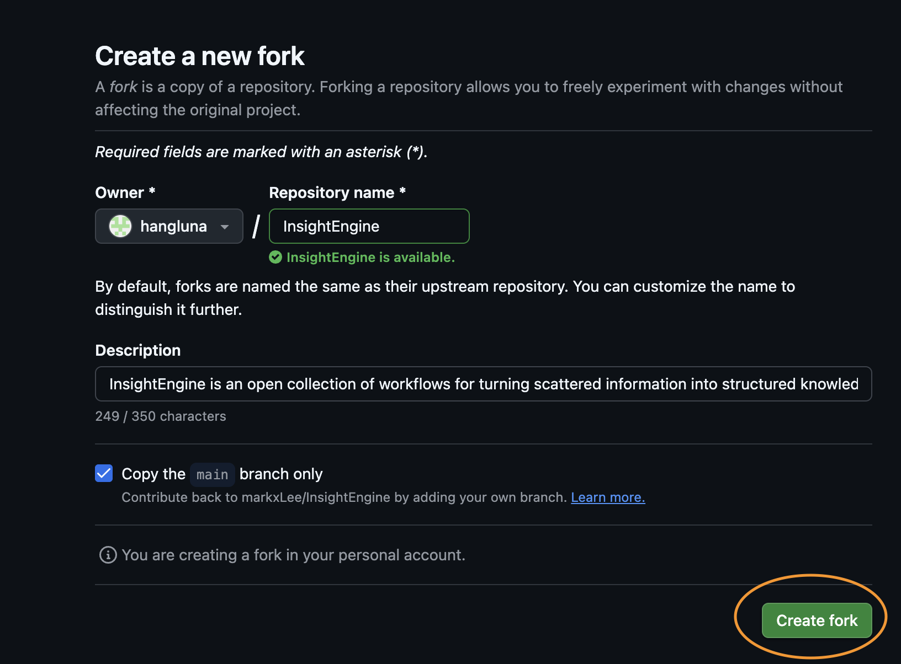
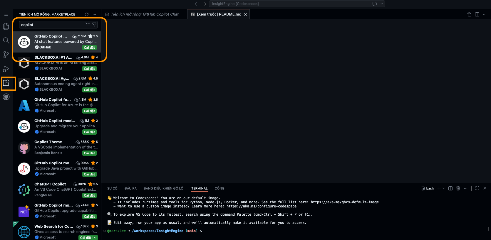
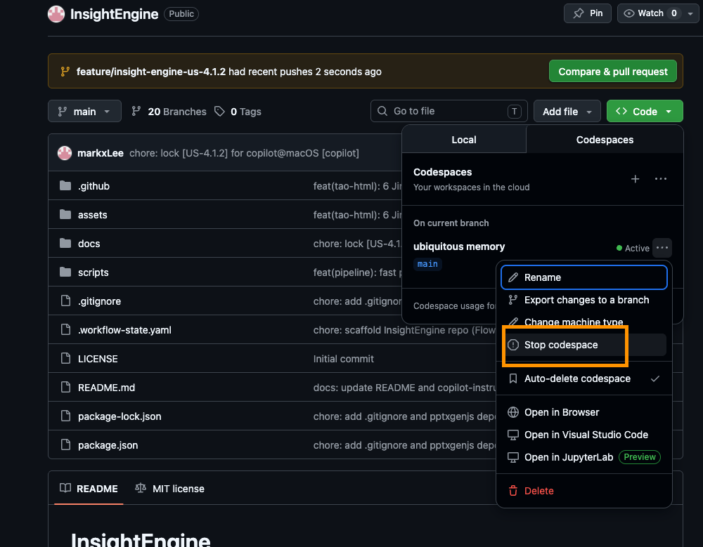

# InsightEngine

Pipeline tổng hợp nội dung đa nguồn → đa định dạng đầu ra, chạy hoàn toàn trong VS Code với GitHub Copilot.

> **🔄 Đã fork repo này?** Bấm **Sync fork → Update branch** trong repo của bạn trên GitHub, sau đó chạy `/cai-dat` để cập nhật.

---

## Getting Started

### Option A — GitHub Codespaces (không cần cài đặt gì, chạy ngay trên trình duyệt)

> **Phù hợp để dùng thử.** GitHub cung cấp [60 giờ Codespaces miễn phí](https://docs.github.com/en/billing/concepts/product-billing/github-codespaces) mỗi tháng. Nhớ **stop codespace sau khi dùng xong** để không vượt quota.

**Bước 1 — Fork repo về tài khoản của bạn**

Vào https://github.com/markxLee/InsightEngine, bấm nút **Fork**:


Điền thông tin fork (giữ nguyên mặc định) rồi bấm **Create fork**:



**Bước 2 — Tạo Codespace**

Trong repo vừa fork, bấm **Code → Codespaces → Create codespace on main**:


Chờ vài phút để Codespace khởi động. VS Code sẽ mở trong trình duyệt.

**Bước 3 — Cài extension GitHub Copilot**

Bấm icon **Extensions** (thanh bên trái), tìm **"copilot"**, chọn **GitHub Copilot** và bấm **Cài đặt**:



Đăng nhập GitHub nếu được hỏi.

**Bước 4 — Dùng InsightEngine**

> ⏱️ **Lần đầu tiên:** Bước `/cai-dat` sẽ cài các thư viện Python/Node.js cần thiết, mất khoảng **2–3 phút**. Chỉ cần làm một lần duy nhất.
>
> ⚡ **Những lần sau:** Start lại codespace là dùng được ngay — không cần cài lại, môi trường đã được lưu.

Mở Copilot Chat (Ctrl+Alt+I hoặc icon chat trên thanh bên), rồi gõ:

```
/cai-dat
```

Sau khi cài xong dependencies, thử ngay:

```
/tong-hop tìm kiếm về xu hướng AI 2025 và tổng hợp thành file Word
```

**Bước 5 — Stop Codespace sau khi dùng xong** ⚠️

Trong repo trên GitHub, bấm **Code → Codespaces**, bấm `...` bên cạnh codespace của bạn và chọn **Stop codespace**:



> Xem chi tiết về quota và billing: https://docs.github.com/en/billing/concepts/product-billing/github-codespaces

---

### Option B — VS Code Local (khuyến nghị nếu dùng thường xuyên)

```bash
git clone https://github.com/<your-username>/InsightEngine
cd InsightEngine
code .
```

Mở Copilot Chat và chạy `/cai-dat` để cài dependencies.

> **Lưu ý:** Image generation (`tao-hinh` với SD-Turbo) chỉ chạy tốt trên Apple Silicon (M1/M2/M3). Các tính năng khác hoạt động trên mọi máy.

---

### Nâng cấp Copilot (tùy chọn)

GitHub Copilot Free có giới hạn request/tháng. Nếu muốn dùng model cao cấp hơn (Claude Sonnet, GPT-4o) và không giới hạn:

👉 https://github.com/settings/copilot/features

---

## 💡 Hướng dẫn sử dụng hiệu quả

### 1. Muốn output dài và chi tiết hơn? Nói rõ trong prompt

InsightEngine mặc định tạo output ở mức vừa phải (~3,000–5,000 từ). Để nhận được tài liệu thực sự chuyên sâu, hãy thêm từ khóa vào yêu cầu:

| Bạn muốn | Từ khóa nên thêm | Kết quả |
|----------|-----------------|---------|
| Tóm tắt nhanh | `"tóm tắt ngắn gọn"`, `"overview"` | ~1,000–2,000 từ, ý chính |
| Báo cáo đầy đủ | *(mặc định — không cần thêm gì)* | ~3,000–5,000 từ, có phân tích |
| Phân tích chuyên sâu | `"phân tích sâu"`, `"chi tiết"`, `"đầy đủ"` | ~8,000–15,000 từ, case study, bảng so sánh |

**Ví dụ:**
```
/tong-hop tìm hiểu về thị trường EV Việt Nam và làm báo cáo Word — phân tích sâu, đầy đủ
```
```
/tong-hop đọc file input/meeting-notes.docx và tóm tắt ngắn gọn thành email
```

---

### 2. Muốn tìm kiếm toàn diện? Mô tả nhiều chiều

Khi yêu cầu liên quan đến so sánh, tổng hợp dữ liệu từ nhiều góc độ, hoặc trải dài theo thời gian — pipeline sẽ tự động kích hoạt chế độ **deep research** (tìm kiếm nhiều vòng, phân tích gaps, bổ sung thêm).

Những dấu hiệu giúp AI nhận ra bạn cần deep research:
- Có **so sánh** hoặc **phân loại** ("so sánh A và B", "phân loại các loại...")
- Trải dài **thời gian** ("từ 2023 đến nay", "qua các năm")
- Yêu cầu **toàn bộ / đầy đủ** ("tất cả các mô hình", "toàn bộ thị trường")
- Có **nhiều chiều thông tin** cần tổng hợp

**Ví dụ prompt kích hoạt deep research:**
```
/tong-hop tổng hợp toàn bộ các mô hình AI lớn từ 2023 đến nay — so sánh benchmark,
nhà phát triển, và ứng dụng thực tế — làm slide dark-modern
```
```
/tong-hop phân tích thị trường fintech Đông Nam Á: phân loại theo phân khúc, so sánh
các nước, xu hướng 2025–2026 — báo cáo Word chi tiết
```

> Pipeline sẽ thông báo khi đang dùng deep research và ước tính thời gian (thường thêm 3–5 phút).

---

### 3. Chọn style phù hợp với ngữ cảnh

Thêm tên style vào cuối yêu cầu để kiểm soát giao diện của slide và HTML:

| Style | Dùng khi nào |
|-------|-------------|
| `corporate` | Báo cáo doanh nghiệp, tài liệu chính thức |
| `academic` | Nghiên cứu, luận văn, hội thảo học thuật |
| `minimal` | Tóm tắt nhanh, nội dung đơn giản |
| `dark-modern` | Tech talks, startup pitches, nội dung công nghệ |
| `creative` | Marketing, sự kiện, workshop |

```
/tong-hop ... và tạo slide style dark-modern
/tong-hop ... xuất HTML style academic
```

Nếu không chỉ định, pipeline sẽ tự chọn style phù hợp nhất với nội dung.

---

### 4. Kết hợp nhiều đầu ra trong một lệnh

InsightEngine hỗ trợ **output chaining** — tạo nhiều file liên kết nhau từ cùng một nguồn dữ liệu:

```
/tong-hop đọc file input/sales_data.xlsx, tạo biểu đồ bar chart và line chart,
rồi nhúng vào báo cáo Word kiểu corporate
```
```
/tong-hop tìm kiếm về AI trends 2025, tạo bảng Excel tổng hợp số liệu,
sau đó dùng số liệu đó làm slide thuyết trình 15 trang
```

---

### 5. Cung cấp file đầu vào đúng cách

Đặt file cần xử lý vào thư mục `input/` trước khi chạy lệnh. Pipeline hỗ trợ:

| Định dạng | Ví dụ |
|-----------|-------|
| Word, PDF, Excel, PowerPoint | `input/report.docx`, `input/data.xlsx` |
| Text, Markdown | `input/notes.txt` |
| URL | Dán trực tiếp vào prompt |
| Web search | Mô tả chủ đề cần tìm kiếm |

```
/tong-hop đọc tất cả file trong thư mục input/ và tổng hợp thành một báo cáo duy nhất
```

---

### 6. Xem và chỉnh sửa kế hoạch trước khi chạy

Trước khi thực hiện, pipeline luôn hiển thị **kế hoạch thực hiện** và hỏi bạn có đồng ý không. Đây là lúc bạn có thể:
- Thay đổi format đầu ra
- Điều chỉnh style
- Thêm hoặc bớt nguồn dữ liệu

Chỉ cần trả lời bằng tiếng Việt — pipeline hiểu và điều chỉnh theo.

---

## Skills

| Skill | Chức năng | Lệnh |
|-------|-----------|------|
| **tong-hop** | Điều phối pipeline — phân tích yêu cầu, gọi các sub-skills | `/tong-hop` |
| **thu-thap** | Thu thập nội dung từ file, URL, tìm kiếm web | `/thu-thap` |
| **bien-soan** | Tổng hợp, gộp nguồn, dịch (Vi↔En), xử lý doc lớn | `/bien-soan` |
| **tao-word** | Tạo Word (.docx) với 3 template style | `/tao-word` |
| **tao-excel** | Tạo Excel (.xlsx) với công thức, định dạng | `/tao-excel` |
| **tao-slide** | Tạo PowerPoint (.pptx) với 5 template style | `/tao-slide` |
| **tao-pdf** | Tạo PDF, hỗ trợ font tiếng Việt | `/tao-pdf` |
| **tao-html** | Tạo HTML tĩnh với 5 template style | `/tao-html` |
| **tao-hinh** | Biểu đồ (matplotlib) + tạo ảnh AI (Apple Silicon) | `/tao-hinh` |
| **thiet-ke** | Thiết kế visual: poster, bìa, certificate, banner | `/thiet-ke` |
| **cai-dat** | Cài đặt / kiểm tra dependencies | `/cai-dat` |

## Pipeline Flow

```
User Request → tong-hop (orchestrator)
  ├─ thu-thap (gather from files/URLs/web)
  ├─ bien-soan (synthesize + translate)
  └─ tao-[format] (output)
       ├─ tao-word (.docx)
       ├─ tao-excel (.xlsx)
       ├─ tao-slide (.pptx)
       ├─ tao-pdf (.pdf)
       ├─ tao-html (.html)
       └─ tao-hinh (charts/images → PNG)
```

## Tech Stack

| Component | Library |
|-----------|---------|
| File reading | markitdown[all] |
| Word output | python-docx |
| Excel output | openpyxl + pandas |
| PPT output | pptxgenjs (Node.js) |
| PDF output | reportlab + pypdf |
| HTML output | jinja2 + inline CSS |
| Charts | matplotlib + seaborn |
| Images | diffusers + torch/MPS (Apple Silicon) |
| Web search | vscode-websearchforcopilot_webSearch |

## License

MIT

